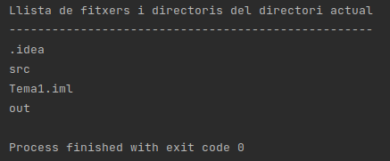

# 2.- La classe File. Generalitats.

En Java, i també en Kotlin per ser una espècie d'extensió de Java, per a
gestionar el sistema de fitxers s’utilitza bàsicament la classe ‘**File** ’.
És una classe que s’ha d’entendre com una referència a la ruta o localització
de fitxers del sistema. **NO representa el contingut** de cap fitxer, sinó la
ruta del sistema on es localitza el fitxer. Com que es tracta d’una ruta, _la
classe pot representar tant **fitxers** com **carpetes o directoris**_.

Si fem servir una classe per a representar rutes, s’aconsegueix una total
independència respecte de la notació que utilitza cada sistema operatiu per
descriure-les. Recordem que Java i Kotlin són llenguatges multiplataforma i,
per tant, s'ha d'intentar fer programes que es puguen executar en qualsevol
Sistema Operatiu (Windows o Linux).

L’estratègia utilitzada per cada SO no afecta la funcionalitat de la classe
**File** , ja que aquesta, en col·laboració amb la màquina virtual, adaptarà
les sol·licituds al SO amfitrió **de forma transparent al programador** , és a
dir, sense necessitat que el programador haja d’indicar o configurar res.

Els objectes creats de la classe File es troben estretament vinculats a la
ruta amb la qual s’han creat. Això significa que les instàncies de la classe
File durant tot el seu cicle de vida **només representaran una única ruta,**
la que se’ls va associar en el moment de la creació. La classe File **no
disposa** de cap mètode ni mecanisme per modificar la ruta associada. En cas
de necessitar noves rutes, **caldrà sempre crear un nou objecte** i no serà
possible reutilitzar els ja creats vinculant-los a rutes diferents.

Per a crear un objecte **File** es pot utilitzar qualsevol dels 3 **constructors**
següents:

  * **File(String _directori_i_fitxer_)**: indiquem en un únic paràmetre tant el directori com el fitxer, és a dir, el fitxer amb la seua ruta. Recordeu que en sistemes Linux per a la ruta utilitzem la barra de dividir, mentre que en Windows la contra-barra. Com que aquest caràcter és el d'_escape_ , s'haurà de posar dues vegades: 
~~~
val fitxer_1 = File("/home/usuari/AD/T1/exemple1.txt")

val fitxer_1 = File("C:\\\AD\\\T1\\\exemple1.txt")
~~~

<u>**Nota**</u>

Cap de les referències anteriors són desitjables, ja que nosaltres intentarem
fer programes que funcionen en qualsevol plataforma, i la primera referència
no funcionarà en Windows, i la segona no funcionarà en Linux. Al llarg del
tema aprendrem com fer les referències de manera que funcionen en qualsevol
plataforma.

Per una altra banda, observeu com hem utilitzat la paraula reservada <b>val</b>
per a crear una constant. Quasi sempre la utilitzarem per als File, ja que
només en algunes ocasions voldrem reutilitzar la variable assignant-li un
altre valor

---

Per a fer referència a un directori s'utilitza la mateixa tècnica, com ja
havíem vist:

~~~
val dir = File("/home/usuari/AD/T1")
~~~
En els exemples anteriors hem posat una ruta absoluta, que comença des de
l'arrel. Si no la posem absoluta (si no comença per / ) serà relativa i
començarà en el directori actiu. Si suposem que el directori actiu és
**/home/usuari** , d'aquesta manera faríem referència al mateix lloc:
~~~
val dir = File("AD/T1");
~~~
<u>** Nota**</u>

Observeu que les anteriors sentències no donarien cap error encara que els
subdirectoris i fitxers no existisquen. No és cap contradicció, ja que podria
ser que férem referència en un File a un fitxer o directori justament per a
crear-lo. Més avant veurem que tenim mètodes per a detectar l'existència real

---
  * **File(String _directori_ , String _fitxer_)**: en el primer paràmetre (String) indiquem el directori amb ruta, i en el segon el fitxer (sense ruta). Farà referència a un fitxer amb el nom com el segon paràmetre col·locat en el directori referenciat en el primer paràmetre. Observeu com el segon paràmetre podria ser també un directori, i per tant seria una referència a un subdirectori del directori referenciat en el primer paràmetre. 
~~~
val fitxer_2 = File("/home/usuari/AD/T1" , "exemple2.txt")
~~~
  * **File(File _directori_ , String _fitxer_)**: Ara el directori és un File creat anteriorment 
~~~
val fitxer_3 = File(dir , "exemple3.txt")
~~~
En els exemples anteriors hem posat directament les rutes. Però els
programadors de Java i de Kotlin han de fer un esforç per independitzar les
aplicacions implementades de les plataformes on s’executaran. Per tant, haurem
d'anar amb cura, fent servir tècniques que eviten escriure les rutes
directament al codi. Per això encara que ara al principi utilitzarem els 3
constructors, en el futur hauríem d'utilitzar massivament el tercer, ja que
com veieu la manera d'especificar la ruta de localització del fitxer, és per
mig d'un altre File, i no ha fet falta posar cap barra de dividir ni cap
contra-barra. Per tant hem fet referència a un fitxer (o subdirectori) dins
d'un directori **sense cap barra ni contra-barra** , i per tant ens val per
qualsevol Sistema Operatiu.

La classe **File** encapsula pràcticament tota la funcionalitat necessària per
gestionar un sistema de fitxers organitzat en arbre de directoris. És una
gestió completa que inclou:

  * Funcions de manipulació i consulta de la pròpia estructura jeràrquica (creació, eliminació, obtenció de la ubicació, etc. de fitxers o directoris)
  * Funcions de manipulació i consulta de les característiques particulars dels elements (noms, mida o capacitat, etc.)
  * Funcions de manipulació i consulta d’atributs específics de cada Sistema Operatiu, com per exemple els permisos d’escriptura, d’execució, atributs d’ocultació. Només funcionarà si el sistema operatiu amfitrió suporta també la funcionalitat d'aquestos atributs.

En la classe original de Java no ens permet accedir al contingut dels fitxers.
Això es resoldrà en el següent tema. Kotlin sí que ens permetrà accedir al
contingut dels fitxers a partir de la classe File, però per coherència ho
deixarem per al proper tema.

<u>**Nota**</u> 

Tots els exemples i exercicis de cada tema els col·locarem en un únic projecte
de Kotlin amb el nom del tema. en aquest cas l'anomenarem <b>Tema1</b>. Els
exemples els col·locarem en un paquet anomenat <b>exemple</b> i els exercicis en
un paquet anomenat <b>exercicis</b>.

En l'apartat Instala.lació de <b>IntelliJ IDEA Ultimate</b> d'aquest tema, hi ha un vídeo
que explica la instal·lació de l'entorn de programació, i
al final d'aquest vídeo s'explica com crear el projecte, els paquets exemples
i exercicis i com copiar els programes en un fitxer Kotlin.

---

Mirem un exemple. Anem a fer un programa per a traure la llista de fitxers i
directoris del directori actual. Per a fer referència al directori actual,
utilitzarem ".", que ens serveix per a tots els Sistemes. Per defecte, el
directori actiu és el directori del projecte. Per a obtenir la llista
d'elements (fitxers i directoris) utilitzarem el mètode **list()** de la
classe **File**. Veurem aquest mètode, juntament amb els mètodes més
importants en la següent pregunta. Copieu-vos el següent en un fitxer Kotlin
anomenat **Exemple_1_1.kt**

    
    
    package exemples
    
    import java.io.File
    
    fun main(args: Array<String>) {
    	val f = File(".")
    	println("Llista de fitxers i directoris del directori actual")
    	println("---------------------------------------------------")
    	for (e in f.list())
    		println(e);
    }

I aquest seria el resultat:

que són els fitxers del directori arrel del projecte Tema1 (situat en la
carpeta **IdeaProjects**). Observeu que fins i tot mostra els fitxers ocults
(que són els que comencen per un punt)

I aprofitant la potencialitat de Kotlin, podem traure fàcilment aquesta llista
ordenada alfabèticament, senzillament posant **.sorted()**. D'aquesta manera,
el programa anterior **Exemple_1_1.kt** ens quedarà ara:

    
    
    package exemples
    
    import java.io.File
    
    fun main(args: Array<String>) {
    	val f = File(".")
    	println("Llista de fitxers i directoris del directori actual")
    	println("---------------------------------------------------")
    	for (e in f.list().sorted())
    		println(e);
    }

I aquest seria el resultat:

Si vulguérem traure el contingut d'un directori concret, el posaríem en el
moment de definir el File, en compte del punt per a indicar el directori
actual.

Una altra modificació seria demanar per teclat el directori del qual volem
mostrar el contingut. Copieu el següent codi en el fitxer Kotlin
**Exemple_1_2.kt**

    
    
    package exemples
    
    import java.io.File
    import java.io.BufferedReader
    import java.io.InputStreamReader
    
    fun main(args: Array<String>) {
    	println("Introdueix un directori:")
    	val ent = BufferedReader(InputStreamReader(System.`in`)).readLine()
    	val f = File(ent)
    	System.out.println("Llista de fitxers i directoris del directori " + ent)
    	System.out.println("---------------------------------------------------")
    	for (e in f.list().sorted())
    		System.out.println(e);
    }
    

Llicenciat sota la  [Llicència Creative Commons Reconeixement NoComercial
CompartirIgual 2.5](http://creativecommons.org/licenses/by-nc-sa/2.5/)

