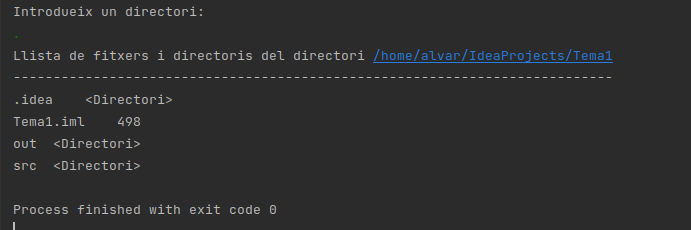

Accés a Dades

[« Anterior](2_la_classe_file_generalitats.md) | [Següent »](exercici.md)
# **3.- Funcionalitat de la classe File**
La classe **File** conté una sèrie de mètodes que ens permeten traure informació relativa al fitxer o directori al que apunta, així com poder navegar (obtenint el pare o accedint a algun dels directoris fills). També ens permetran manipular ambdues coses, modificant la informació i l'estructura de directoris (crear directoris nous, esborrar, canviar el nom, ...). Veurem alguns d'ells, agrupats per categories.

Per cert, com que ens interessa fer les aplicacions sense haver de dependre de la plataforma, ens serà molt útil poder situar-nos en l'arrel del dispositiu sense haver de posar-lo a mà. Això s'aconsegueix amb el mètode *static* de File anomenat **listRoots()**. En sistemes Linux tornarà un únic element, però en sistemes Windows tornarà l'arrel de cada unitat del sistema, per això és un array. Aquesta és una manera d'obtenir un File que apunta a l'arrel (i en el cas de Windows a l'arrel de C:):

val f = File.listRoots()[0]

` `Si en Windows vulguérem anar a l'arrel de **D:**, hauríem de posar **File.listRoots()[1]**, i així successivament.

Una altra cosa que pot dur a engany és que perfectament **pot no existir** el fitxer o directori especificat en la creació del File. Recordeu que no estem accedint encara al contingut dels fitxers. I perfectament podem crear un File d'un fitxer o directori que no existeix, justament per a crear-lo.

Mètodes per a obtenir el nom o la ruta

|**getName()** |Torna el nom del fitxer o directori |
| :- | :- |
|**getPath()** |Torna la ruta (relativa) |
|**getAbsolutePath()** |Torna la ruta absoluta |
|**getCanonicalPath()**|Torna la ruta absoluta sense possibles redundàncies|

**getPath()** dóna la ruta fins arribar al fitxer, però relativa, tal i com s'especifica en el moment de crear el File.

**getAbsolutePath()** dóna la ruta absoluta, des de l'arrel. En determinades ocasions poden haver redundàncies en la ruta

**getCanonicalPath()** dóna la ruta absoluta, des de l'arrel, i sense redundàncies. Té com a inconvenient una utilització més complicada que getAbsolutePath.

En el següent exemple s'intenta mostrar això de les redundàncies, que **getCanonicalPath()** resol completament. Observeu com per a il·lustrar l'exemple fem referència a un fitxer d'una forma complicada. Suposem que el directori actiu és **/home/usuari/workspace/Tema1**, i volem fer referència a un fitxer situat en un subdirectori anomenat **fitxers**. Si copiem el següent codi en el fitxer **Exemple\_1\_3.kt**:

package exemples

import java.io.File

fun main(args: Array<String>) {

`	`val f = File("fitxers/../fitxers/f1.txt")

`	`println("Nom del fitxer: " + f.getName())

`	`println("Ruta del fitxer: " + f.getPath())

`	`println("Ruta absoluta del fitxer: " + f.getAbsolutePath())

`	`println("Ruta canònica del fitxer: " + f.getCanonicalPath())

}

Si suposem que el directori actiu és **/home/usuari/IdeaProjects/Tema1** (recordeu que per defecte el directori actiu és el directori on està el projecte), el resultat serà:

Nom del fitxer: f1.txt

Ruta del fitxer: fitxers/../fitxers/f1.txt

Ruta absoluta del fitxer: /home/usuari/IdeaProjects/Tema1/fitxers/../fitxers/f1.txt

Ruta absoluta del fitxer: /home/usuari/IdeaProjects/Tema1/fitxers/f1.txt

` `Recordeu que no cal que existesca el fitxer **f1.txt**, o el subdirectori **fitxers**.

Mètodes per a obtenir els fills o el pare

|**list()**|Torna un **array de Strings** amb els noms de tots els elements continguts en el File |
| :- | :- |
|**listFiles()**|Torna un **array de Files** amb tots els elements continguts en el File|
|**getParent()** |Torna el **nom** (string) del pare (si no existeix per ser l'arrel, tornarà nul) |
|**getParentFile()**|Torna el **pare com un File** (si no existeix per ser l'arrel, tornarà nul) |

Ja hem vist la utilitat de **list()**, que torna un array de strings. En ocasions ens serà de moltíssima utilitat **listFiles()**, ja que torna un array de Files. Si a açò adjuntem els mètodes **getParent()** i **getParentFile()**, veiem que podrem navegar pel sistema de fitxers.

Mètodes per veure l'existència i característiques

|**exists()** |Torna true si el fitxer o directori existeix |
| :- | :- |
|**isDirectory()** |Torna true si és un directori |
|**isFile()** |Torna true si és un fitxer |
|**length()** |Torna la grandària del fitxer en bytes |
|**lastModified()** |Torna la data de modificació del fitxer o directori|
|**setLastModified()**|Actualitza la data de modificació del fitxer o directori|

Com ja havíem comentat abans, en el moment de crear el File, pot ser existesca o no el fitxer o directori, és a dir, que potser es corresponga o no amb un fitxer real. Si volem comprovar l'existència podem utilitzar el mètode **exists()**.

Anem a modificar l'exemple 2, on tornàvem tots els fitxers i directoris d'un directori introduït per teclat. Primer ens assegurem que existeix i és un directori. Després el millorarem tornant la grandària de cada fitxer si és un fitxer, i especificant que és un directori, si ho és. Ens convindrà **listFiles()** per a poder mirar si és un fitxer o directori, la grandària, ... També hem aprofitat per crear el mètode estàtic **llistat(File)**, que mostrarà el contingut del directori on apunta el File, i així estructurar-lo un poc millor. Copieu el següent codi en un fitxer anomenat **Exemple\_1\_4.kt**

package exemples

import java.io.BufferedReader

import java.io.File

import java.io.InputStreamReader

fun main(args: Array<String>) {

`	`println("Introdueix un directori:")

`	`val ent = BufferedReader(InputStreamReader(System.`in`)).readLine()

`	`val f = File(ent)

`	`if (f.exists()) {

`		`if (f.isDirectory()) {

`			`llistaDirectori(f)

`		`} else

`			`println("No és un directori")

`	`} else

`		`println("No existeix el directori")

}

fun llistaDirectori(f: File) {

`	`val s = "Llista de fitxers i directoris del directori " + f.getCanonicalPath()

`	`println(s)

`	`println("-".repeat(s.length))

`	`for (e in f.listFiles().sorted()) {

`		`if (e.isFile())

`			`println(e.getName() + "\t " + e.length())

`		`if (e.isDirectory())

`			`println(e.getName() + "\t <Directori>")

`	`}

}

I aquest seria el resultat si introduïm el directori actual ( . )

Mètodes per als permisos

Els següents mètodes ens permeten consultar i modificar els permisos del File, al més pur estil Linux

|**canRead()** |Torna true si es té permís de lectura sobre el fitxer o directori |
| :- | :- |
|**canWrite()** |Torna true si es té permís d'escriptura sobre el fitxer o directori|
|**canExecute()**|Torna true si és executable|
|**setReadable(Boolean,Boolean)**|Dóna permís o no de lectura sobre el fitxer, segons el primer paràmetre. En el segon indiquem si afecta només al propietari (true) o a tot el món (false)|
|**setWritable(Boolean,Boolean)**|Dóna permís d'escriptura o no, segons el valor del primer paràmetre. El segon actua igual que abans|
|**setExecutable(Boolean,Boolean)**|Dóna permís d'execució, segons el valor del primer paràmetre. El segon actua igual que abans|

Mètodes de creació i esborrat

Ens permetran crear diectoris, fitxers buits i esborrar-los

|**createNewFile()** |Crea un fitxer nou buit associat al File, sempre que no existesca ja un amb el mateix nom |
| :- | :- |
|**delete()** |Esborra el fitxer o directori |
|**mkdir()** |Crea un directori amb el nom indicat en la creació del File. Ha d'existir el directori pare|
|**mkdirs()**|Com l'anterior, però si cal crea tots els directoris de la ruta necessaris|
|**renameTo(String nou\_nom)** |Canvia el nom del fitxer o directori |

Mètodes sobre l'espai del dispositiu

També disposem de mètodes que ens diuen l'espai total i lliure del dispositiu on està situat el File

|**getFreeSpace()**|Torna l'espai lliure del dispositiu on està situat el File|
| :- | :- |
|**getUsableSpace()**|Torna l'espai utilitzable per l'aplicació (menor que l'espai lliure)|
|**getTotalSpace()** |Torna l'espai total del dispositiu on està situat el File |

Mètodes específics de Kotlin

Kotlin afegeix funcionalitat a la classe File. Així el següents mètodes són específics de Kotlin, i no els trobaríem en Java

|**walk()**|Torna una seqüència per a visitar tots els fitxers i subdirectoris, i els seus continguts. Es pot indicar la manera d'accedir als subdirectoris amb paràmentres. La manera d'actuar per defecte és primer mostrar el propi directori, i després els descendents|
| :- | :- |
|**walkTopDown()**|El mateix que l'anterior en l'opció per defecte|
|**walkBottomUp()** |Igual que l'anterior, però mostrant abans els descendents i després el propi directori|

Per tant són una forma còmoda per a accedir a tota l'estructura de directoris i fitxers que pengen de l'actual directori.

Modificarem l'exemple 2, per a mostrar ara tots els descendents del directori intruït per teclat. Copieu el següent codi en en un fitxer anomenat **Exemple\_1\_5.kt**

package exemples

import java.io.File

import java.io.BufferedReader

import java.io.InputStreamReader

fun main(args: Array<String>) {

`    `println("Introdueix un directori:")

`    `val ent = BufferedReader(InputStreamReader(System.`in`)).readLine()

`    `val f = File(ent)

`    `System.out.println("Llista de fitxers i directoris del directori " + ent)

`    `System.out.println("---------------------------------------------------")

`    `for (e in f.walk().sorted())

`        `System.out.println(e);

}

I el resultat seria, si introduïm el directori actual ( . ):

Es pot observar que primer mostra un determinat directori i després tot el seu contingut. Per exemple **./src** està abans que tots els seus descendents. Amb **walkBottomUp()** seria a l'inrevès, per exemple primer tots els descendents de **./src**, i després el propi **./src**

[« Anterior](2_la_classe_file_generalitats.md) | [Següent »](exercici.md)

Llicenciat sota la [Llicència Creative Commons Reconeixement NoComercial CompartirIgual 2.5](http://creativecommons.org/licenses/by-nc-sa/2.5/)

