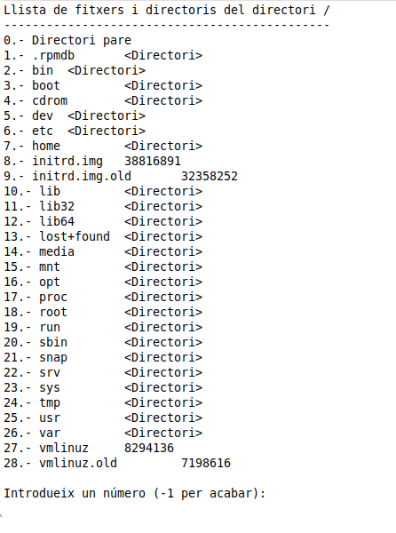

Accés a Dades

[« Anterior](3_funcionalitat_de_la_classe_file.md)
# **Exercici 1**

Realitza un programa en un fitxer anomenat **Exercici\_1.kt** en el paquet **exercicis**, que permeta navegar pels directoris de la unitat principal del sistema d'arxius.

- Ha de començar per l'arrel (/ en Linux; c:\ en Windows). Recordeu que el mètode estàtic **File.listRoots()[0]** ens dóna l'arrel.
- Ha d'indicar el directori que està mostrant.
- Ha de posar com a primera opció anar al directori pare (opció 0).
- Ha de posar un número davant de cada arxiu o subdirectori que s'està mostrant. Observeu que aquest número comença amb 1 (el 0 és per al pare). Si us heu guardat en un array la llista de fitxers i directoris del directori actual, recordeu que el primer element és el 0 (però vosaltres el mostrareu amb un 1 davant).
- En cas de ser un arxiu ha de dir la grandària. En cas de ser un subdirectori, ha d'indicar-lo amb **<directori>**
- Posteriorment ha de deixar introduir un número. Les opcions seran: 
  - -1 per acabar
  - 0 anar al directori pare.
  - Si s'ha triat el 0 (per anar al pare) s'ha de controlar que existeix el pare (en el cas de l'arrel, no en té). Si no en té, no s'ha de fer res.
  - Qualsevol altre número ha de servir per canviar a aquest directori com a directori actiu. Si era un fitxer, no ha de fer res (en la imatge, no s'ha de poder anar al 9, ja que és un fitxer).
  - S'ha de controlar que hi ha permís de lectura sobre un directori, abans de canviar a ell, sinó donarà error (en la imatge, per exemple, segurament no es podrà canviar al directori **root**, ja que no tindrem permís de lectura sobre ell). Aquesta comprovació s'ha de fer abans de canviar al directori triat.
  - I s'ha de controlar que el número introduït està en el rang correcte (en la imatge, de -1 fins a 28)

La següent imatge mostra el resultat:

Voluntari

Modifica l'anterior per a que també ens proporcione dades sobre si és un directori, els permisos, grandària i data de modificació a l'estil de Linux quan fas **ls -l** . L'aspecte podria ser aquest:

Llicenciat sota la [Llicència Creative Commons Reconeixement NoComercial CompartirIgual 2.5](http://creativecommons.org/licenses/by-nc-sa/2.5/)

